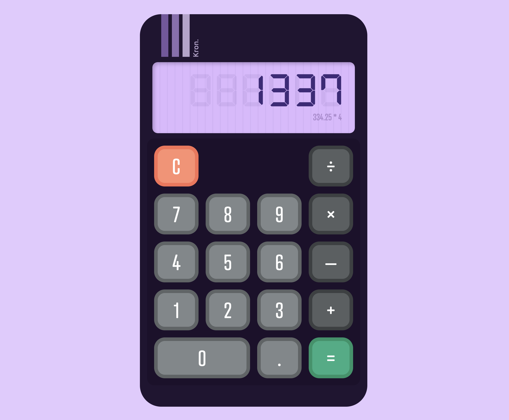

# Kron Calculator

#### This is the primary codebase for the Kron Calculator

[](./public/img.png)

The Kron Calculator is a small reactive application that allows for basic arithmatic to two decimal places.

## Technology

The Kron Calculator was built on a modern web stack which includes the following technologies:

* [React.js](https://react.dev/) - The library for web and native user interfaces.
* [TypeScript](https://www.typescriptlang.org/) - A strongly typed programming language that builds on JavaScript.
* [Create-React-App](https://create-react-app.dev/) - Set up a modern web app by running one command..
* [JSS](https://cssinjs.org/) - An authoring tool for CSS which allows you to use JavaScript to describe styles.
* [Math.js](https://mathjs.org/) - An extensive math library for JavaScript and Node.js.

## Getting Started

**1. Install application dependencies:**

```
npm install
```

**2. Start the application on `localhost:3000`:**

```
npm start
```

## Known Limitations

- The display does not resize so large numbers will not fit on the display.
- Lack support for "±" and "%" functionality.
- Pressing "=" twice will not re-execute the last operation in the sequence.
- Might break in unexpected ways as there are no unit tests.
